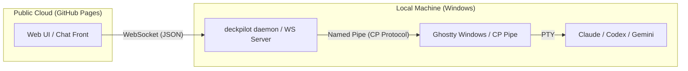

# [Architectural Shift] Implementing WebSocket Bridge for Local-First Web UI (GitHub Pages Support)

## 1. 概要 (Context)
現在、`photo-ai-rust` や `deckpilot` の Web UI 構想は、GitHub Pages での公開を前提としていますが、ブラウザのサンドボックス制限により、ローカルの Windows 名前付きパイプやハードコードされた開発パスに直接アクセスすることができません。

このドキュメントでは、`deckpilot daemon` を拡張し、ブラウザ（GitHub Pages）とローカルの Ghostty プロセスを安全かつ透過的に接続するための **「WebSocket ブリッジ」** アーキテクチャの導入を提案します。

## 2. 現在の課題 (Current Limitations)
*   **名前付きパイプの絶縁:** ブラウザ上の JavaScript は OS レベルのパイプを直接叩けない。
*   **ハードコードされたパス依存:** `findGhostty()` 等が開発環境の絶対パスに依存しており、配布や公開に適さない。
*   **静的サイトの限界:** GitHub Pages はバックエンドを持たないため、ターミナルの PTY 操作を中継する「誰か」が手元に必要。

## 3. 提案アーキテクチャ: Local-First Web Bridge
GitHub Pages (UI) + Local Daemon (Bridge) + Ghostty (Terminal) の 3 層構造を採用します。

### **構成図:**

## 4. 実装要件 (Technical Requirements)

### **A. deckpilot daemon の WebSocket サーバー化**
*   `deckpilot daemon` に HTTP/WebSocket サーバー機能を追加（デフォルトポート: 8080）。
*   **CORS 対応:** `https://yuujikamura.github.io` からの接続を許可する設定。
*   **プロトコル変換:**
    *   Browser (WS): `{ "cmd": "SEND", "session": "xxx", "msg": "base64..." }`
    *   ↓ (Translation)
    *   Ghostty (Pipe): `SEND|xxx|base64...`

### **B. セッション発見の動的化**
*   ハードコードされたパスに頼らず、実行中のプロセスや `%LOCALAPPDATA%` 内の `.session` ファイルから動的に Ghostty を発見し、Web UI 側にセッション一覧をプッシュ送信する。

### **C. Ghostty-Web (WASM) との統合**
*   `coder/ghostty-web` はレンダリング（描画）のみを担当。
*   実際の入出力（PTY データのストリーミング）は WebSocket 経由でローカルの Ghostty 本体と同期する。

## 5. メリット (Benefits)
*   **セキュリティ:** ローカルでの実行権限はユーザーが手元で起動する `deckpilot` に限定される。
*   **ポータビリティ:** UI は GitHub Pages で最新版を即時配信でき、バックエンドは個々の Windows 環境に最適化された状態を維持できる。
*   **拡張性:** モバイル端末（LINE ブラウザ等）から、同じネットワーク内の PC 上の Ghostty を操作する道が開ける。

## 6. 次のステップ (Next Steps)
1.  `daemon/ipc.go` に WebSocket ハンドラーを試験実装。
2.  `photo-ai-rust` のフロントエンドに WebSocket クライアントを統合。
3.  GitHub Pages 上で、ローカルの `deckpilot` を介して Ghostty が応答することを確認する。

---
*Authored by AI Agent (Claude 3.5 Sonnet)*
